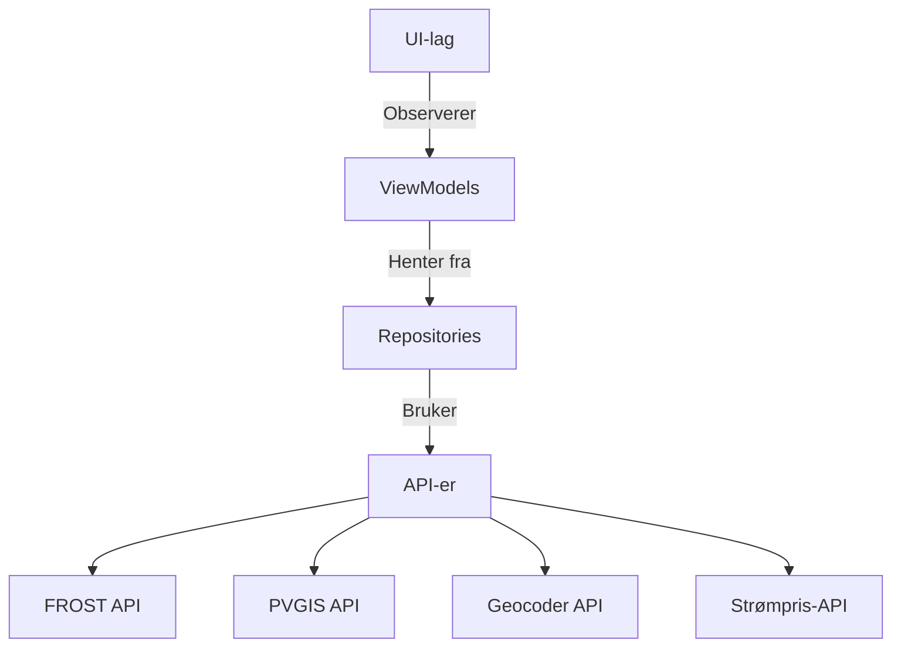

# **APP NAVN** ######

### **Team 37 | IN2000-V25**
Sist oppdatert: 09.04.2025
## 1. Introduksjon

Dette dokumentet beskriver arkitekturen for '''''' som  bruker Frost API and PVGIS API for å beregner, energiprodukjson gjennom hele året, lønnsomheten til solcellepaneler, og viser hvilke elektriske apparater som kan brukes med kun energien som produseres av panelene. Appen følger MVVM (Model-View-ViewModel) og bruker moderne Android Jetpack-komponenter som Compose.
### Nøkkelteknologier

    Minimum API-nivå: 26 – Balanserer kompatibilitet og moderne funksjonalitet, de fleste mobiltelefoner kan kjøre appen.

    Språk: Kotlin

    Biblioteker:

        Jetpack Compose (UI)
        
        ViewModel, LiveData (tilstandshåndtering)

        KTOR (API-kall)

        Maps (visnig av kart)

## 2. Arkitekturdiagram
   Må fikses

## 3. Lagdeling
### 3.1 UI-lag (Views)

#### Komponenter:

    Skjermer:

        HomeScreen: Navigasjonshub, her kan man velge de andre skjermene.

        PriceScreen: Viser strømpris med graf for de førkjellige områder i Norge.
        
        InfoScreen: Viser informasjon om solcellepaneler, og om støtte fra Enova.
        
        MapScreen: Adressesøk med Geocoder og viser kart med Maps, bruker setter også inn input som ResultScreen bruker.

        ResultScreen: Viser beregnet energi produkjson per måned eller hele året og man kan velge å gå til skjerm som viser besparelse .

        SavingScreen: Viser besparelse.

        /////SLETTE//// SavedLocationsScreen: Lagrede brukerlokasjoner.

        Navigasjon: BottomNavBar med NavController for å navigere.

#### Prinsipper:

    UDF (Unidirectional Data Flow): UI sender hendelser til ViewModels og observerer tilstandsendringer.

### 3.2 ViewModel-lag

#### Komponenter:

    MapScreenViewModel: Konverterer adresser til koordinater.

    WeatherDataViewModel: Henter værdata (temperatur, skydekke).

    PriceScreenViewModel: Henter strømpriser per region.

    SavedLocationsViewModel: Håndterer lagring av lokasjoner.

#### Viktige mønstre:

    Dependency Injection: ViewModels injiserer repositories.

    Tilstandshåndtering: Eksponerer LiveData/StateFlow til UI.

### 3.3 Datalag (Repositories)

#### Komponenter:

    HomeData(Strømpris): Henter strømpriser fra API  med ElectricityPriceApi og lagrer priser for dagen i ElectricityPriceRespository.

    Mapdata : Henter lat og long fra en adresse og lagrer i en repository som heter AdressRespository.
    
    WeatherData: Henter fra FROST API med FrostDataSource (temperatur, snødekke, sydekke) og lagrer den i WeatherRespository, 
    henter global innstråling  via PVGIS API med PVGISapi og lagrer i WeatherRepository.

#### Cache-strategi:

    Appen benytter ingen persistent caching. All data som hentes fra eksterne API-er (FROST, PVGIS, Geocoder, strømpris-API) lagres kun i minnet under en aktiv økt. 
    Når appen avsluttes eller settes i bakgrunnen i lengre tid, slettes denne dataen automatisk.

    Begrunnelse:

    - De fleste API-kall er raske og inneholder fersk informasjon (adress, solenergi, strømpris), så det er ønskelig at brukeren alltid får oppdatert data.

    - Ved å unngå lokal caching unngås også behovet for å holde styr på cache-utløpsdatoer og datavalidering. Dette gjør appen enklere å vedlikeholde,
      men medfører at brukerens data og resultatene ikke bevares mellom økter. Dette er et akseptabelt kompromiss i denne versjonen.

### 3.4 API-lag

#### Integrerte API-er:

    FROST API (Værdata):
        INPUT: Koordinater
        OUTPUT: avg_temperature, snow_cover, cloud_cover.

    PVGIS API (Solenergi):
        INPUT: Koordinater, vinkel, retning 
        OUTPUT: Output: global innstråling per måned i kWh/m².

    Geocoder API: 
        INPUT: adresse
        OUTPUT: adresse til koordinater.

    Strømpris-API: 
        INPUT:
        OUTPUT: Regionale priser (f.eks. Nord-Norge).

## 4. Designvalg
### 4.1 MVVM-begrunnelse

    - Separasjon av ansvar: Vi har valgt Model-View-ViewModel (MVVM) for å oppnå en tydelig separasjon mellom presentasjonslaget (UI),
    forretningslogikken og datatilgang.
    UI håndterer kun brukergrensesnitt og brukerinteraksjoner, mens ViewModel inneholder logikk knyttet til visningstilstand
    og datahåndtering. Repository-laget henter og formidler 
    data fra ulike API-er som FROST, PVGIS, Geocoder og strømpris-API..

    - Testbarhet: Ved å isolere logikken i ViewModels og repositories kan disse enkelt testes med enhetstester uten avhengigheter
    til Android-rammeverket. Dette gir høyere kodekvalitet og reduserer risiko for regresjonsfeil ved endringer.

### 4.2 Tilstandshåndtering

    Vi benytter én enkelt sannhetskilde (single source of truth) per skjerm i ViewModelen.
    Dette gjør at UI-et alltid reflekterer gjeldende tilstand, enten det gjelder værdata, 
    solinnstråling, strømpriser eller brukerens valgte parametere (som takvinkel, areal og effektfaktor). 
    Tilstanden holdes i StateFlow eller LiveData, som observeres av 
    Composable-funksjoner i Jetpack Compose.

    Feilhåndtering er implementert i ViewModelene for å fange og respondere på ulike typer feil:
    - API-feil (nettverksproblemer, timeouts, 404 osv.):
        - Disse håndteres med try-catch-blokker og resulterer i at brukergrensesnittet viser en informativ Snackbar eller feilmelding.

    - Manglende eller ugyldige brukerdata (f.eks. ingen takareal angitt): 
        - Valideres før API-kall. Feil vises i UI som valideringsfeil under inputfelt.

### 4.3 Modularitet

    com.team37.////APPNAVN//// /
    ├── data/
    │   ├── homedata/
    │   │   ├── ElectricityPriceAPi
    │   │   └── ELectrictyPriceRepository
    │   ├── mapdata/
    │   │   ├── AddressRepository
    │   │   └── MapRepository
    │   └── weatherdata/
    │      ├── FrostAPi
    │      ├── PVGISApi
    │      └── WheaterRepository
    ├── model/
    │   ├── electricity/
    │   │  ├── ElectricityPrice
    │   │  └── Region
    │   ├── map/
    │   │  └── GeocodingRespone
    │   └── weather/
    │      ├── Energy
    │      └── Radiation
    ├── ui/
      ├── electricity/
      │   ├── PriceScreen
      │   ├── PriceScreenViewModel
      │   └── PriceViewModelFactory
      ├── font/
      │   ├── FontScaleViewModel
      │   └── FontSize
      ├── handling/
      │   ├── DecimalInputField
      │   └── LoadingScreen
      ├── help/
      │   ├── AppHelp
      │   └── TechnicalHelp
      ├── home/
      │   ├── HomeScreen
      │   └── HomeScreenViewModel
      ├── inforscreen/
      │   └── InfoScreen
      ├── language/
      │   └── LanguageUtils
      ├── map/
      │   ├── MapScreen
      │   └── MapScreenViewModel
      ├── navigation/
      │   ├── BorromSheets
      │   └── Nav
      ├── result/
      │   ├── ResultScreen
      │   └── WheatherScreenViewModel
      └── theme/
          ├── Color
          ├── Theme
          └── Type
        

## 5. Vedlikeholdsguide
### 5.1 Utvidelse av appen

    Ny funksjonalitet:

        Opprett et nytt ViewModel (f.eks. IncentivesViewModel).

        Legg til repository hvis nye datakilder trengs.

        Design UI med @Composable-funksjoner.

    Endring av API-er:

        Oppdater KTOR-grensesnitt i api/ og tilpass repositories.

### 5.2 Testing

    Enhetstester: Mock repositories  eller mock data for å teste ViewModels.

    UI-tester: Bruk ComposePreview for å teste UI.

## 6. Vedlegg

    GitHub-repositorium: github.uio.no/IN2000-V25/team-37

### Hvorfor API-nivå 24?

#### Valget av Android 8.0 (API 26) sikrer:

    Kompatibilitet: Dekker ~95.4% av aktive Android-enheter (per 2025).

    Funksjonalitet: Støtter nødvendige Jetpack-biblioteker.

    Kompromiss: Unngår for høyt minimumsnivå som ekskluderer brukere.

