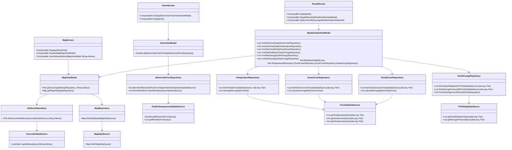

Class Diagram

```mermaid

    classDiagram
    class HomeScreen{
        +Composabele DisplayElectricityPrice(HomeViewModel)
        +Composable DispalyInfo()
    }
     class MapScreen{
        +Composable DisplayAdressFelt()
        +Composable DispalyMap(MapViewModel)
        +Composable SendAdressButton(MapViewModel,String Adress)
    }
    class ResultScreen{
        +Composable DisplayInfo()
        +Composable DispalyResults(WeatherDataViewModel)
        +Composable Diplay MonthlySavings(WeatherDataViewModel)

        
    }
    %% ViewModels
   class HomeViewModel {
        +Double getElectricityPriceForToday(ElectricityPriceRepository)
        
    }

    class MapViewModel {
        +Pair<Double, Double> getLatLong(AddressRepository, String Adress)
        +Map getMapData(MapRepository)
    }

    class WeatherDataViewModel {

        +List<AvergeMonthlySnowCover> monthlySnowData(SnowCoverRepository)
        +List<AvergeMonthlyTemperatures> monthlyTempData(TemperatureRepository)
        +List<AvergeMonthlyClouds> monthlyCloudData(CloudCoverRepository)

        +List<Radiation> monthlyRadiation(SolarEnergyRepository)
        +List<EnergyProduction> monthlyEnergy(SolarEnergyRepository)
        +List<MonthlySavings> monthlySavings(SolarEnergyRepository)
        
        fetchWeatherData(latLong: Pair<Double, Double>,TemperatureRepository,CloudCoverRepository,SnowCoverRepository,SolarEnergyRepository)

        
    }

    %% Repositories
    class ElectricityPriceRepository {
        +Double fetchElectricityPriceForToday(HvaErStrømprisenApiDataSource)
        +List<MonthlyPrice> fetchMonthlyPrice(HvaErStrømprisenApiDataSource)
    }

    class AddressRepository {
        +Pair<Double, Double> fetchCurrentAddress(GeocoderDataSource,String Adress)
    }

    class MapRepository {
        +Map fetchMapData(MapDataSource)
        
    }

    class TemperatureRepository {
         +List<Temperatues> fetchTemp(FrostApiDataSource, latLong: Pair<Double, Double>)

        +List<AvergeMonthlyTemperatures> calculateAverge(fetchTemp)
    }
    

    class SnowCoverRepository {

        +List<Snows> fetchSnowCover(FrostApiDataSource,latLong: Pair<Double, Double>)

        +List<AvergeMonthlySnowCover> calculateAverge(fetchSnowCover)
    }

    class CloudCoverRepository {
        +List<Clouds> fetchCloudCover(FrostApiDataSource,latLong: Pair<Double, Double>)

        +List<AvergeMonthlyClouds> calculateAverge(fetchCloudCover)
    }

    class SolarEnergyRepository {
         +List<Radiation> fetchSolarRadiation(PVGISApiDataSource,latLong: Pair<Double, Double>)

        +List<EnergyProduction> fetchEnergyProduced(PVGISApiDataSource,latLong: Pair<Double, Double>)

        +List<MonthlySavings> FetchSavings(List<EnergyProduction>,ElectricityPriceRepository )
    }

    %% Data Sources / APIs
    class HvaErStrømprisenApiDataSource {
        +Double getElectricityPriceQuery()
        +List<monthlyPrice> getMonthlyPriceQuery()
    }

    class GeocoderDataSource {
        +LiveData<List<Pair<Double, Double>>>getAddressQuery(String Adress)
    }

    class MapDataSource {
        +Map fetchMapDataQuery()
    }

    class FrostApiDataSource {
        +List<Temperatures> getTemperatureQuery(latLong: Pair<Double, Double>)
        +List<Snows> getSnowCoverQuery(latLong: Pair<Double, Double>)
        +List<Clouds> getCloudCoverQuery(latLong: Pair<Double, Double>)
    }

    class PVGISApiDataSource {
        +List<Radation> getSolarRadiationQuery(latLong: Pair<Double, Double>)
        +List<EnergyProduction> getEnergyProducedQuery(latLong: Pair<Double, Double>)
    }

    
    %% Relationships
    HomeScreen --> HomeViewModel
    ResultScreen --> WeatherDataViewModel
    MapScreen --> MapViewModel
    HomeViewModel --> ElectricityPriceRepository
    ElectricityPriceRepository --> HvaErStrømprisenApiDataSource

    MapViewModel --> AddressRepository
    MapViewModel --> MapRepository
    AddressRepository --> GeocoderDataSource
    MapRepository --> MapDataSource
    
    WeatherDataViewModel --> MapViewModel
    WeatherDataViewModel --> TemperatureRepository
    WeatherDataViewModel --> SnowCoverRepository
    WeatherDataViewModel --> CloudCoverRepository
    WeatherDataViewModel --> SolarEnergyRepository

    TemperatureRepository --> FrostApiDataSource
    SnowCoverRepository --> FrostApiDataSource
    CloudCoverRepository --> FrostApiDataSource

    SolarEnergyRepository --> PVGISApiDataSource


```