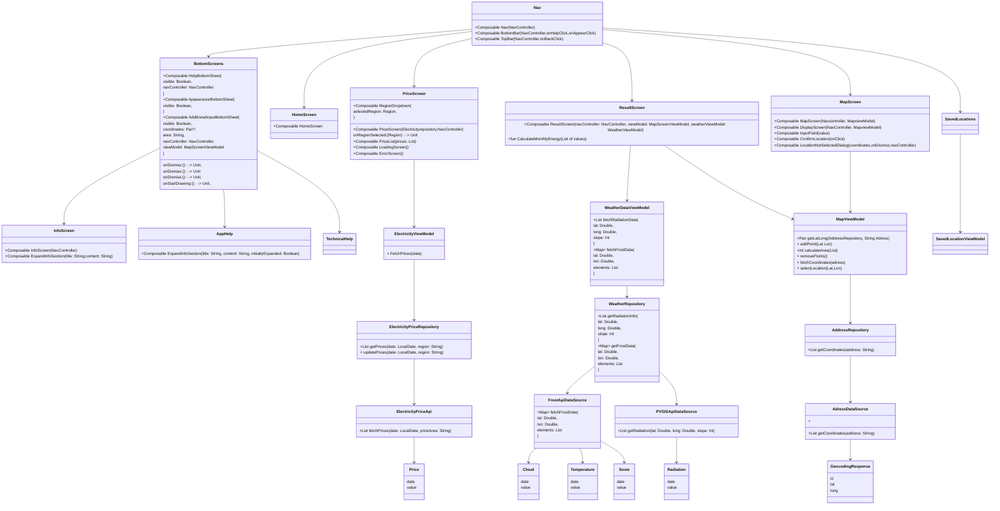

CONTENT
   Architecture draft for MVP demo.
MODELING
Class Diagram Newest Version

```mermaid

    classDiagram
    class AppHelp{
        +Composable ExpandInfoSection(title: String, content: String, initiallyExpanded: Boolean)
    }
    class TechnicalHelp{
        
    }

    class HomeScreen{
        
        +Composable HomeScreen
    }
     class MapScreen{
        +Composable MapScreen(Navcontroller, MapviewModel)
        +Composable DisplayScreen(NavController, MapviewModel)
        +Composable InputField(value)
        +Composable ConfirmLocation(onClick)
        +Composable LocationNotSelectedDialog(coordinates,onDismiss,navController)
        
    
    }
    class ResultScreen{
        +Composable ResultScreen(navController: NavController, viewModel: MapScreenViewModel, weatherViewModel: WeatherViewModel )
        +fun CalculateMonthlyEnergy(List of values)

        
    }
    class PriceScreen{
    +Composable PriceScreen(Electricityrepository,NavController)
    +Composable RegionDropdown(
    selectedRegion: Region,
    onRegionSelected: (Region) -> Unit
)
    +Composable PriceList(prices: List<ElectricityPrice>)
    +Composable LoadingScreen()
    +Composable ErrorScreen()

}
    class InfoScreen{
    +Composable InfoScreen(NavController)
    +Composable ExpandInfoSection(title: String,content: String )
    
    }
    %% Nav
    class Nav{
    +Composable Nav(NavController)
    +Composable BottomBar(NavController,onHelpClick,onAppearClick)
    +Composable TopBar(NavController,onBackClick)

}
    class BottomScreens{
    +Composable HelpBottomSheet( 
    visible: Boolean,
    onDismiss: () -> Unit,
    navController: NavController,

    )
    +Composable AppearanceBottomSheet(
    visible: Boolean,
    onDismiss: () -> Unit
)
    +Composable AdditionalInputBottomSheet(
    visible: Boolean,
    onDismiss: () -> Unit,
    onStartDrawing: () -> Unit,
    coordinates: Pair<Double, Double>?,
    area: String,
    navController: NavController,
    viewModel: MapScreenViewModel
)
    }
    class SavedLocations{
    
    }

    
    
    
    %% ViewModels
    class ElectricityViewModel{
        +  FetchPrices(date)
    }

    class MapViewModel {
        +Pair<Double, Double> getLatLong(AddressRepository, String Adress)
        + addPoint(Lat Lon)
        +int calculateArea(List<Lat, Lon>)
        + removePoints()
        + fetchCoordinates(adress)
        + selectLocation(Lat,Lon)
    }

    class WeatherDataViewModel {

         +List<Radiation> fetchRadiationData(
        lat: Double,
        long: Double,
        slope: Int
    )

        +Map<String, Array<Double>> fetchFrostData(
        lat: Double,
        lon: Double,
        elements: List<String>
    )
    
        
    }
    
    


    %% Repositories

    class ElectricityPriceRepository {
        +List<ElectricityPrice> getPrices(date: LocalDate, region: String)
        + updatePrices(date: LocalDate, region: String)
    }

    class AddressRepository {
      +List<GeocodingResponse> getCoordinates(address: String)
    
    }

    

    class WeatherRepository {
         +List<Radiation> getRadiationInfo(
        lat: Double,
        long: Double,
        slope: Int
    )

        +Map<String, Array<Double>> getFrostData(
        lat: Double,
        lon: Double,
        elements: List<String>
    )
    }
    

    %% Data Sources / APIs
    class ElectricityPriceApi {
       +List<ElectricityPrice> fetchPrices(date: LocalDate, priceArea: String)
    }

    

    class AdressDataSource {
        +List<GeocodingResponse> getCoordinates(address: String)
        +
    }

    class FrostApiDataSource {
       +Map<String, Array<Double>> fetchFrostData(
        lat: Double,
        lon: Double,
        elements: List<String>
    )
    }

    class PVGISApiDataSource {
        +List<Radiation> getRadiation(lat: Double, long: Double, slope: Int)
    }
    %% Data classes
    class Temperature{
        date 
        value

    }
    class Snow{
     date 
        value
    }
    class Cloud{
     date 
        value
    }
    
    class Radiation{
     date 
        value
    }
    class Price{
     date 
        value
    }
    class GeocodingResponse{
        id
        lat
        long
    }
    
    %% Relationships

    HomeScreen
    ResultScreen --> WeatherDataViewModel
    MapScreen --> MapViewModel

    PriceScreen--> ElectricityViewModel
    ElectricityViewModel -->ElectricityPriceRepository
    ElectricityPriceRepository --> ElectricityPriceApi
    ElectricityPriceApi --> Price

    MapViewModel --> AddressRepository
    AddressRepository--> AdressDataSource
    AdressDataSource --> GeocodingResponse
    BottomScreens --> InfoScreen
    BottomScreens --> AppHelp
    BottomScreens --> TechnicalHelp
    SavedLocations --> SavedLocationViewModel
    Nav--> Bottom Screens
    Nav --> HomeScreen
    Nav --> PriceScreen
    Nav --> ResultScreen
    Nav --> MapScreen
    Nav --> SavedLocations
    
   ResultScreen --> MapViewModel
    WeatherDataViewModel --> WeatherRepository
    
    

     WeatherRepository --> FrostApiDataSource
    

     WeatherRepository --> PVGISApiDataSource

    FrostApiDataSource --> Cloud
    FrostApiDataSource --> Temperature
    FrostApiDataSource --> Snow

    PVGISApiDataSource --> Radiation
    
```
