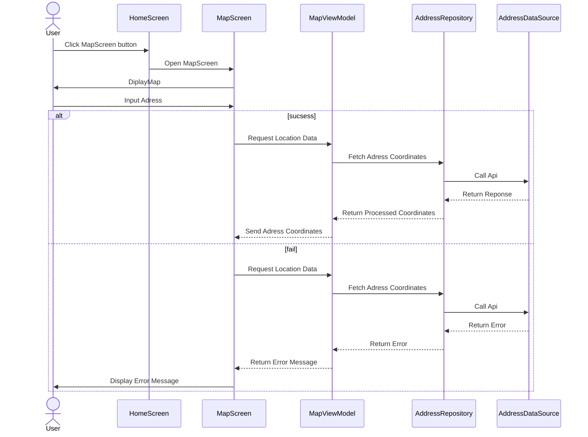
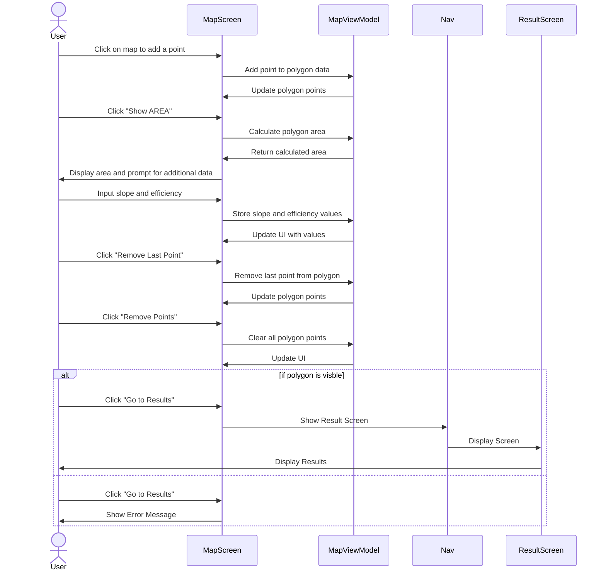

MapScreen: Find Adress

```mermaid
    sequenceDiagram

    actor User
    participant HomeScreen
    participant MapScreen
    participant MapViewModel
    participant AddressRepository
    participant AddressDataSource

    User ->> HomeScreen: Click MapScreen button
    HomeScreen ->> MapScreen: Open MapScreen
    MapScreen ->> User: DiplayMap 

    User ->> MapScreen : Input Adress
    alt sucsess
        MapScreen ->> MapViewModel: Request Location Data
        MapViewModel ->> AddressRepository: Fetch Adress Coordinates
        AddressRepository ->> AddressDataSource: Call Api
        AddressDataSource -->> AddressRepository: Return Reponse
        AddressRepository -->> MapViewModel: Return Processed Coordinates
        MapViewModel -->> MapScreen : Send Adress Coordinates
        
    else fail 
        MapScreen ->> MapViewModel: Request Location Data
        MapViewModel ->> AddressRepository: Fetch Adress Coordinates
        AddressRepository ->> AddressDataSource: Call Api
        AddressDataSource -->> AddressRepository: Return Error
        AddressRepository -->> MapViewModel: Return Error
        MapViewModel -->> MapScreen : Return Error Message
        MapScreen ->> User: Display Error Message

    end

    
    
```
MapScreen: DrawArea

```mermaid
    sequenceDiagram

    actor User
    
    participant MapScreen
    participant MapViewModel
    
    participant Nav
    participant ResultScreen

    User ->> MapScreen: Click on map to add a point
    MapScreen ->> MapViewModel: Add point to polygon data
    MapViewModel ->> MapScreen: Update polygon points

    User ->> MapScreen: Click "Show AREA"
    MapScreen ->> MapViewModel: Calculate polygon area
    MapViewModel ->> MapScreen: Return calculated area
    MapScreen ->> User: Display area and prompt for additional data

    User ->> MapScreen: Input slope and efficiency
    MapScreen ->> MapViewModel: Store slope and efficiency values
    MapViewModel ->> MapScreen: Update UI with values

    User ->> MapScreen: Click "Remove Last Point"
    MapScreen ->> MapViewModel: Remove last point from polygon
    MapViewModel ->> MapScreen: Update polygon points

    User ->> MapScreen: Click "Remove Points"
    MapScreen ->> MapViewModel: Clear all polygon points
    MapViewModel ->> MapScreen: Update UI

    alt if polygon is visble 

    User ->> MapScreen : Click "Go to Results"
    MapScreen ->> Nav : Show Result Screen
    Nav ->> ResultScreen : Display Screen
    ResultScreen ->>User : Display Results

    else 
    User ->> MapScreen : Click "Go to Results"
    MapScreen ->> User : Show Error Message
    end

```

